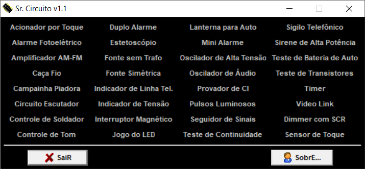
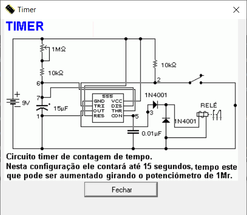

# Sr Circuito

Software developed in 2001-2003 using Delphi (Object-Pascal) language.

## Features

- Database with many small electronic circuits.

## Screenshots

---

Presidente Prudente, SP, Brazil

[SENAI, "Santo Paschoal Crepaldi" - Serviço Nacional de Aprendizagem Industrial](https://presidenteprudente.sp.senai.br/)

